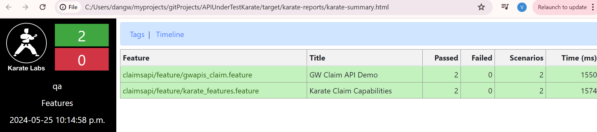

# APIUnderTestKarate

Test Automate get and post request for Application Under Test(AUT) https://github.com/vinitad12/APIUnderTest

# Debug a particular test case
mvn test -Dkarate.options="--tags @newtest"
mvn test -Dkarate.options="--tags @smoke" -Dkarate.env="qa" // env as qa

// run the bulk load cases
`mvn test -Dkarate.options="--tags @bulkload" -Dkarate.env="qa"`

// run smoke or bulk load tags
mvn test -Dkarate.options="--tags @smoke,@bulkload" -Dkarate.env="qa"
// run scenario which been tagged as smoke AND bulkload
`mvn test -Dkarate.options="--tags @smoke -t @bulkload" -Dkarate.env="qa"`

Report

